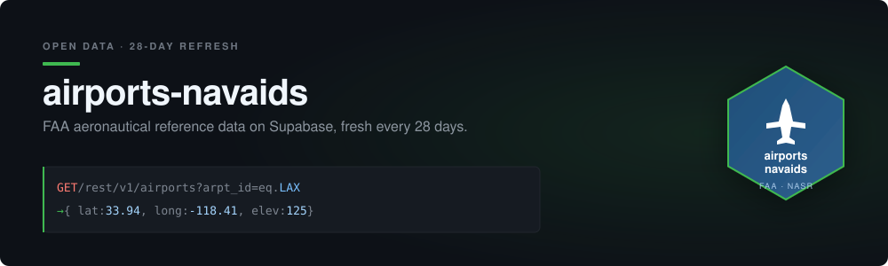

<div align="center">
  

  <p>
    <a href="https://github.com/mikehickey2/airports-navaids/actions/workflows/daily-pipeline.yml"></a>
    
    
    
    
    
  </p>
</div>

# FAA Aeronautical Reference Platform

**Status:** Active &nbsp;·&nbsp; **Version:** 2.0.0 &nbsp;·&nbsp; **Software Date:** 2026-06-09 &nbsp;·&nbsp; **NASR Database Date:** <!-- pipeline:faa_date -->2026-06-11<!-- /pipeline:faa_date --> &nbsp;·&nbsp; **Author:** Mike Hickey  
**Primary Data Source:** [FAA NASR 28-Day Subscription](https://www.faa.gov/air_traffic/flight_info/aeronav/aero_data/NASR_Subscription/)

---

## Just Want the Data?

You don't need to clone this repo or set anything up. Query the database directly using the public API key:

```
Public Key (read-only): sb_publishable_B8oP0zIj3jUD8qX6lTeVOA_8lM_f1-E
```

```bash
# Example: Get all California airports
curl "https://bjmjxipflycjnrwdujxp.supabase.co/rest/v1/airports?state_code=eq.CA" \
  -H "apikey: sb_publishable_B8oP0zIj3jUD8qX6lTeVOA_8lM_f1-E"
```

This key is **read-only** - you can query all <!-- pipeline:airports_count -->19,408<!-- /pipeline:airports_count --> facilities and <!-- pipeline:navaids_count -->1,635<!-- /pipeline:navaids_count --> navaids but cannot modify data. See [API Access](#api-access) for more examples.

---

## Overview

This project provides a reusable backend platform that ingests publicly available FAA aeronautical reference data (airports and navaids), stores it in a Supabase-hosted Postgres database, and exposes it via a REST API. The platform supports multiple downstream projects requiring authoritative lookup of identifiers and coordinates.

The `airports` table holds **all NASR landing facilities**, not just public-use airports. Consumers distinguish them via `facility_use` (public/private) and `site_type_code`:

| `site_type_code` | Facility type |
|------------------|---------------|
| A | Airport |
| H | Heliport |
| C | Seaplane base |
| G | Gliderport |
| B | Balloonport |
| U | Ultralight |

**Current Data:**
- <!-- pipeline:airports_count -->19,408<!-- /pipeline:airports_count --> facilities
- <!-- pipeline:navaids_count -->1,635<!-- /pipeline:navaids_count --> navaids

---

## Quick Start

### Prerequisites
- R 4.5.x or 4.6.x (see [R 4.6 support](#r-46-support) below for the one-time toolchain step)
- Required packages installed via `renv::restore()` from the lockfile
- Supabase account with API key
- renv for dependency management

### R 4.6 support

R 4.6.0 (released 2026-04-24) hardened the C API and required two coordinated changes for this project to build locally:

1. **Update Apple Command Line Tools.** R 4.6 needs a clang that ships the modern macOS SDK headers (which declare `Rf_findVar` and friends). Apple clang 21.0.0+ works. Update with `xcode-select --install` or via Software Update.
2. **Bump 8 stale package pins.** The pinned versions of `backports`, `ps`, `processx`, `checkmate`, `cli`, `rlang`, `magrittr`, and `vctrs` had C source that did not compile against R 4.6's `Rinternals.h`. Current CRAN versions of each carry the fix. The `renv.lock` in this repo is already updated, so `renv::restore()` works end to end on R 4.6 today.

CI continues on R 4.5 (configured in `.github/workflows/daily-pipeline.yml`) and is unaffected by the bumps because all updates are minor or patch versions with full backward compatibility.

### Setup

1. Clone the repository
2. Copy `.Renviron.example` to `.Renviron` and add your Supabase API key:
   ```
   SUPABASE_API_KEY=your_key_here
   ```
3. Run the SQL in `sql/create_tables.sql` in Supabase SQL Editor (first time only)

### Update Data

```r
source("R/scrape_airports_navaids.R")
```

This will:
- Check FAA website for new NASR subscription data
- Download if newer than local data
- Clean and filter the data
- Push to Supabase

---

## Security Model

This project uses Supabase Row Level Security (RLS) with the new API key format:

| Key Type | Format | Access | Use Case |
|----------|--------|--------|----------|
| **Public** (publishable) | `sb_publishable_...` | READ only | Anyone querying airports/navaids |
| **Secret** | `sb_secret_...` | Full (bypasses RLS) | Data pipeline (R scripts, GitHub Actions) |

**Permissions:**
- Public key: Can only SELECT data (read-only). Safe to share publicly.
- Secret key: Can INSERT, UPDATE, DELETE. Keep confidential.

**Important:** The pipeline requires a `secret` key. Using a `publishable` key will fail on INSERT/DELETE operations.

**Schema convention:** Tables in `sql/create_tables.sql` declare least-privilege Data API grants explicitly — `anon` and `authenticated` get `SELECT` only, `service_role` gets `SELECT, INSERT, UPDATE, DELETE` plus sequence access. The schema also `REVOKE`s Supabase's legacy auto-grants so the result is least-privilege regardless of when the schema is applied. Required because Supabase removes auto-grants for new `public`-schema tables on existing projects starting 2026-10-30. See [Supabase discussion #45329](https://github.com/orgs/supabase/discussions/45329).

---

## Project Structure

```
airports-navaids/
├── R/
│   ├── scrape_airports_navaids.R  # Main pipeline - orchestrates everything
│   ├── clean_airports.R           # Cleans and validates FAA airport data
│   ├── clean_navaids.R            # Cleans and validates FAA navaid data
│   ├── run_cleaning.R             # Cleaning-stage orchestration + dispatcher
│   ├── push_to_supabase.R         # Pushes to Supabase via REST API
│   └── update_readme.R            # Updates README with pipeline results
├── sql/
│   └── create_tables.sql          # PostgreSQL schema for Supabase
├── data/
│   ├── raw/                       # Downloaded FAA CSV files
│   ├── clean/                     # Cleaned CSV outputs
│   └── pipeline_history.csv       # Historical counts per update
├── .Renviron                      # API credentials (gitignored)
└── .Renviron.example              # Template for credentials
```

---

## API Access

This database is publicly accessible for read-only queries.

### Public API Key (Read-Only)

```
sb_publishable_B8oP0zIj3jUD8qX6lTeVOA_8lM_f1-E
```

This key provides **read-only access** to airports and navaids data. It cannot modify data.

### Example Queries

```bash
# Get airports in California
curl "https://bjmjxipflycjnrwdujxp.supabase.co/rest/v1/airports?state_code=eq.CA" \
  -H "apikey: sb_publishable_B8oP0zIj3jUD8qX6lTeVOA_8lM_f1-E"

# Get VOR navaids
curl "https://bjmjxipflycjnrwdujxp.supabase.co/rest/v1/navaids?nav_type=eq.VOR" \
  -H "apikey: sb_publishable_B8oP0zIj3jUD8qX6lTeVOA_8lM_f1-E"

# Search airport by identifier
curl "https://bjmjxipflycjnrwdujxp.supabase.co/rest/v1/airports?arpt_id=eq.LAX" \
  -H "apikey: sb_publishable_B8oP0zIj3jUD8qX6lTeVOA_8lM_f1-E"
```

### From R

```r
library(httr2)

# Public key - safe to hardcode for read-only access
PUBLIC_KEY <- "sb_publishable_B8oP0zIj3jUD8qX6lTeVOA_8lM_f1-E"

resp <- request("https://bjmjxipflycjnrwdujxp.supabase.co/rest/v1/airports") |>
  req_headers(apikey = PUBLIC_KEY) |>
  req_url_query(state_code = "eq.CA") |>
  req_perform() |>
  resp_body_json()
```

---

## Automated Updates

The pipeline runs automatically via GitHub Actions.

### How It Works

1. **Daily check** at 12:00 UTC - scrapes FAA website for current subscription date
2. **Conditional execution** - full pipeline runs only when new data is available
3. **Results** - written to GitHub Actions job summary (visible in workflow run page)
4. **README auto-update** - commits updated counts and FAA date back to the repo
5. **Notifications** - creates a GitHub Issue on pipeline success or failure (push notifications via GitHub Mobile)

### Setup

1. **Add GitHub Secret** (Settings -> Secrets -> Actions):

   | Secret | Description |
   |--------|-------------|
   | `SUPABASE_API_KEY` | Your Supabase secret key (`sb_secret_...`) |

2. **Enable workflow:**
   - Go to Actions tab -> Enable workflows
   - Optionally trigger manually via "Run workflow" with force option

### Notifications

Pipeline runs create GitHub Issues automatically:
- **Success**: Issue labeled `pipeline-run` with airports/navaids counts and FAA date
- **Failure**: Issue labeled `pipeline-failure` with link to run logs

Push notifications via GitHub Mobile are enabled by default for repo owners.
Daily check-only runs (no new data) do not create issues. No additional secrets required.

---

## Pipeline History

Each successful pipeline run logs counts to `data/pipeline_history.csv`:

| Column | Description |
|--------|-------------|
| faa_date | FAA subscription effective date |
| airports | Number of airports |
| navaids | Number of navaids |
| run_timestamp | When the pipeline ran |

Analyze trends over time:
```r
history <- readr::read_csv("data/pipeline_history.csv")
plot(history$faa_date, history$navaids, type = "l")
```

---

## Data Schema

### airports
| Column | Type | Description |
|--------|------|-------------|
| arpt_id | TEXT | Airport identifier (e.g., "LAX") |
| arpt_name | TEXT | Airport name |
| facility_use | TEXT | Facility use: public or private |
| city | TEXT | City |
| state_code | TEXT | State code |
| lat_decimal | NUMERIC | Latitude |
| long_decimal | NUMERIC | Longitude |
| elev | NUMERIC | Elevation (feet) |
| icao_id | TEXT | ICAO identifier |
| site_type_code | TEXT | Facility type: A=airport, H=heliport, C=seaplane, G=glider, B=balloon, U=ultralight |

### navaids
| Column | Type | Description |
|--------|------|-------------|
| nav_id | TEXT | Navaid identifier |
| nav_type | TEXT | Type (NDB, VOR, VORTAC, etc.) |
| name | TEXT | Navaid name |
| state_code | TEXT | State code |
| lat_decimal | NUMERIC | Latitude |
| long_decimal | NUMERIC | Longitude |
| elev | NUMERIC | Elevation (feet) |

---

## Goals

- [x] Provide a single authoritative reference database for airports and navaids
- [x] Provide fast read access through a stable API for downstream tools
- [x] Support cycle-based updates when FAA publishes new data (every 28 days)
- [x] Keep write access limited to ingestion automation
- [x] Keep the design portable for future AWS migration

---

## Future Enhancements

- Add database indexes for frequently queried columns
- Create R/Python client packages
- Add additional FAA data types (airways, fixes, procedures)
